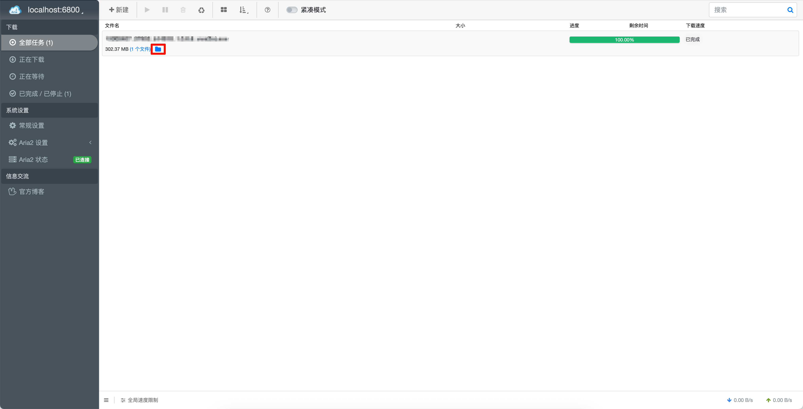

# aria2-explorer-open-in-finder
1. 安装并启动 `aria2`，在 `Chrome/Edge` 安装 `Aria2-Explorer`。
   
2. 把脚本目录放到电脑中：
   ```
   tools/aria2-browse
   ```
   
3. 在终端里运行：
   ```
   cd /Users/.../tools/aria2-browse
   ./install.sh
   ```
   这一步会自动：
    - 编译原生 `Aria2Browse.app`
    - 安装到 `~/Applications/Aria2Browse.app`
    - 注册 `aria2:// URL Scheme`

4. 在 `Aria2-Explorer` 里配置打开 `常规设置` -> `RPC` -> `下载目录打开程序URL`，填：
   ```
    aria2://browse?dir=${taskdir}&name=${taskname}
   ```

5. 测试本机 handler 是否正常。先手工执行：
   ```
   open 'aria2://browse?dir=/Applications&name=Calculator.app'
   ```
   如果 `handler` 正常，会打开对应目录或在 `Finder` 中定位文件。

6. 如果有问题，看日志。
   ```
   tail -n 50 ~/Library/Logs/Aria2Browse.log
   ```
   正常应能看到:
   ```
   - received apple event url=...
   - resolved target=...
   ```
   需要的核心文件是：
   ```
   tools/aria2-browse/Aria2Browse.swift
   tools/aria2-browse/build.sh
   tools/aria2-browse/install.sh
   ```

一句话版：电脑上只要运行一次 `./install.sh`，然后在 `Aria2-Explorer` 里把 URL 填成 `aria2://browse?dir=${taskdir}&name=${taskname}` 就可以了。



